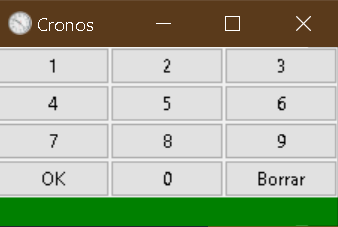
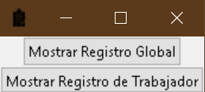
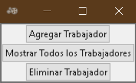
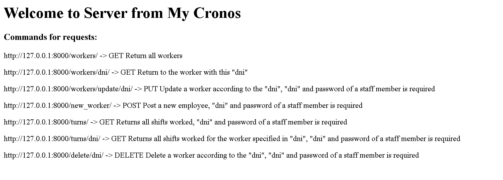
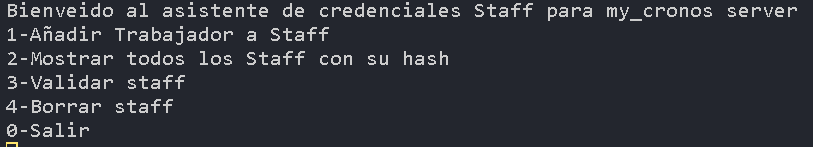

# My_Cronos - Shift Control System

My_Cronos is an application designed to facilitate the control of entry and exit of workers in a company. The application consists of three main components: my_cronos, registry, and management.

## Index

- [System Components](#components)
- [System Requirements](#requirements)
- [Installation](#installation)
- [Usage](#usage)
- [Contribute](#contribute)
- [License](#license)

## Components

### 1. My_Cronos

 
My_Cronos is a numeric keypad that allows workers to enter their id turn entry to register their shift entry or exit. The id turn entry has a maximum of 8 digits and is used to validate the worker's identity.

### 2. Registry

 
The Registry component provides various options for viewing the shift history of workers, both globally and by individual worker.

### 3. Management

 
The Management application is essential for managing the worker database. It allows for creating new workers, viewing existing worker information, and deleting records from the database as needed. This functionality is crucial for the proper functioning of the system.

### 4. Server

 
Server deploys a server for endpoint queries, for use with managers such as Postman.

### 5. Staff

 
Staff is a terminal program for managing credentials on Server (Required for applications that need Staff privileges).

## Requirements

- Python 3.10
- Required libraries: tkinter, sqlite3

If you do not want to download the Release located in the right-hand section --> You can do so by cloning this repository.

## Installation

1. git clone <https://github.com/EmmanuelMMontesinos/My_Cronos>
2. Navigate to the project directory: cd my_cronos
3. run the dependency installer and python: install.bat in Windows or install.sh in Linux
4. run the program you need (My Cronos,Registro...): My Cronos.bat in Windows or My Cronos.sh in Linux

## Usage

After registering workers from the Management application:

1. Open the my_cronos.py application to access the numeric keypad.
2. Enter the worker's id turn entry (maximum 8 digits).
3. Use the Registry application to view the shift history.
4. Use the Management application to manage the worker database, including creation, viewing, and deletion of records.

## Contribute

If you wish to contribute to My_Cronos, please follow these steps:

1. Fork the repository.
2. Create a new branch for your feature: git checkout -b new-feature
3. Make your changes and commit: git commit -m 'Add new feature'
4. Push your changes to your repository: git push origin new-feature
5. Send a pull request to the main repository.

## License

My_Cronos is distributed under the MIT license. For more details, see the LICENSE file.
